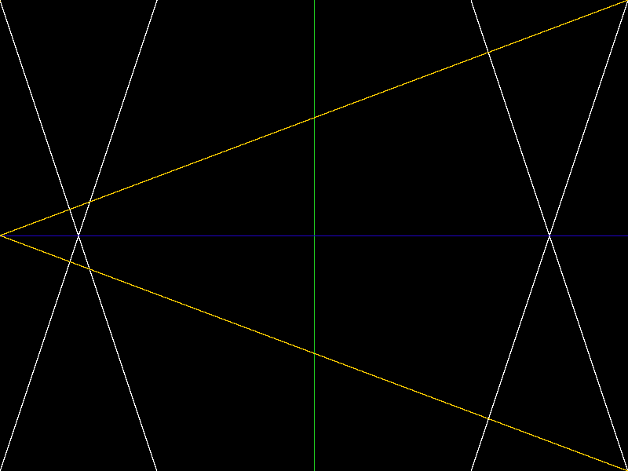
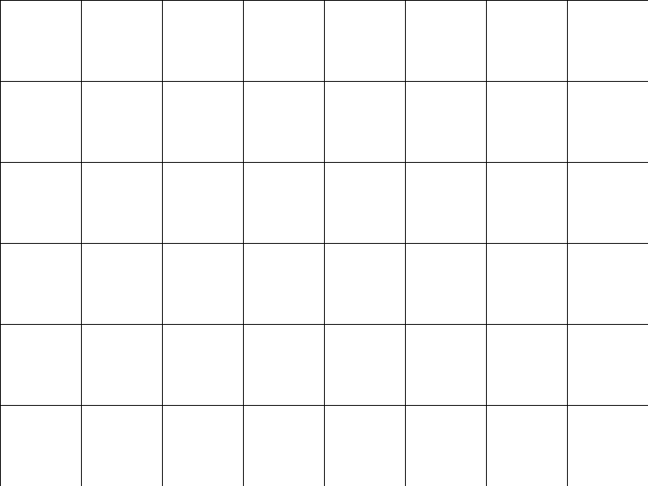
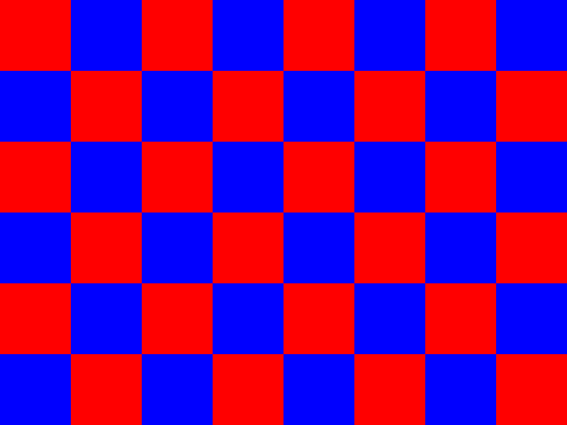
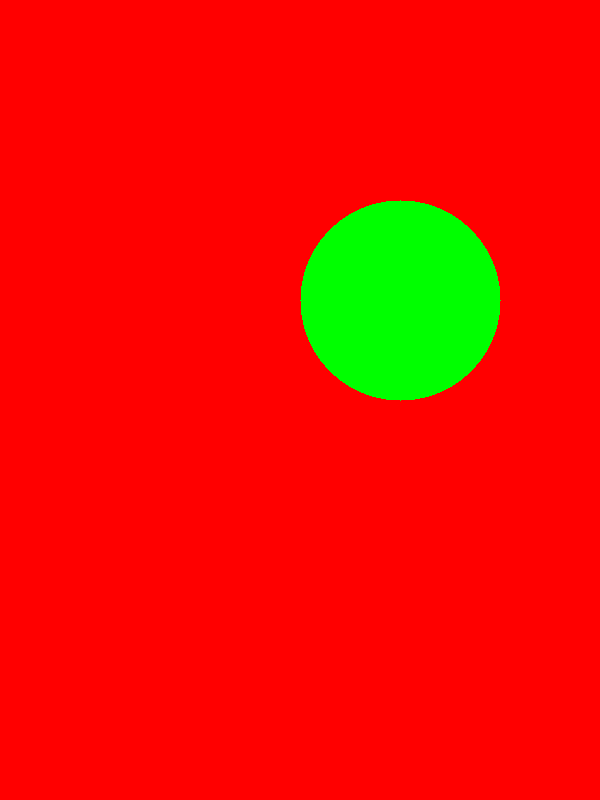
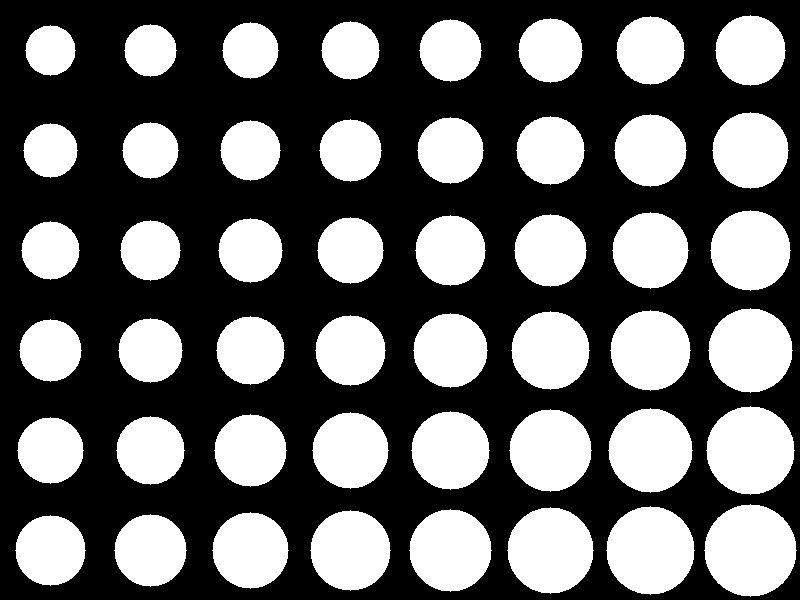
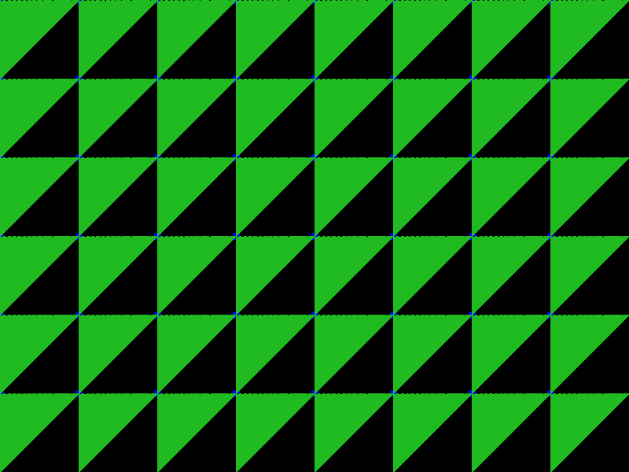

# Olive.cpp

Simple 2d Graphics Library for C++

## Quick Start


```console
$ bash bash.sh
$ ./runnable
```

## To render on to a browser

```
python3 -m http.server 8000
```

You can now view the output on localhost:8000


## Gallery 

### Simple figures!

#### Lines



#### Checkerboard of lines



#### Rectangle



#### Circle



#### Checkerboard of circles



#### Triangles


#### Checkerboard of triangles



